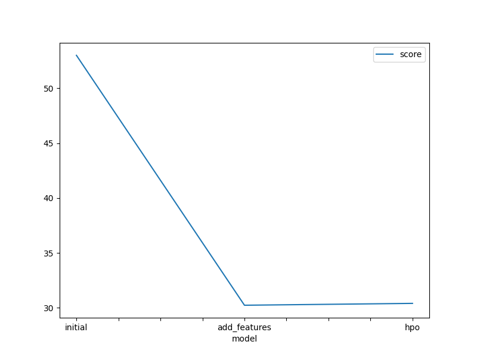
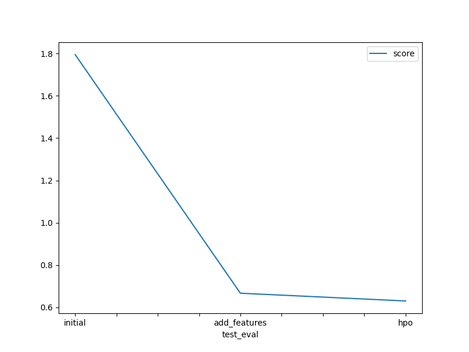

# Report: Predict Bike Sharing Demand with AutoGluon Solution
#### Ragdha ALi Elgaidi

## Initial Training
### What did you realize when you tried to submit your predictions? What changes were needed to the output of the predictor to submit your results?
- I had to fix some syntax errors and review additional documentation in order to run the model as intended. 
- I had some trouble starting the tasks on my local environment and I decided to do everything in the SageMaker studio and managed to improve my results and get a score of 0.62 while in the beginning I only managed to get scores of above 1.799.

### What was the top ranked model that performed?
- The top ranked model is WeightedEnsemble_L3 with score -53.009491  

## Exploratory data analysis and feature creation
### What did the exploratory analysis find and how did you add additional features?
- I did an exploratory data analysis by creating a histogram to show the distribution of all features.
- I found that the datetime features would be more useful if I could extract additional information about the hour, day, and month.
- By using these new features, I could analyse the bike demand by hour of the day, day of the week, and month of the year to discover new information pattern.
### How much better did your model preform after adding additional features and why do you think that is?
- The initial RMSE score from the first model is 1.79.
- By using the additional features I managed to significantly improve the model and gained the score of 0.67.
## Hyper parameter tuning
### How much better did your model preform after trying different hyper parameters?
yes, it is improve my score

### If you were given more time with this dataset, where do you think you would spend more time?
 I would try to explore the dataset and create additional features, and try more options on the hyperparameter tunings
### Create a table with the models you ran, the hyperparameters modified, and the kaggle score.
|model|hpo1|hpo2|hpo3|score|
|--|--|--|--|--|
|initial|Default| 	Default |	Default|1.7955|
|add_features|Parsing of Dates |	Four columns Added |	feature selection|0.66615|
|hpo|GBM, NN|RF ,CAT| 	Bagging ,Stack level|0.62946|

### Create a line plot showing the top model score for the three (or more) training runs during the project.

### Create a line plot showing the top kaggle score for the three (or more) prediction submissions during the project.

## Summary
- In this project I was able to apply all the concepts that were covered in this course, by using this skills I was able to develop a machine learning regression model by using the autogluon framework, at the end the results were good because the kaggle score of my model was close to the professional developers with years of experince.
- The most benefit is received by working with new features . Working forward my goal would be to improve the model by taking into consideration the working hours which impact the bike demand and the seasonal spikes and lows.
